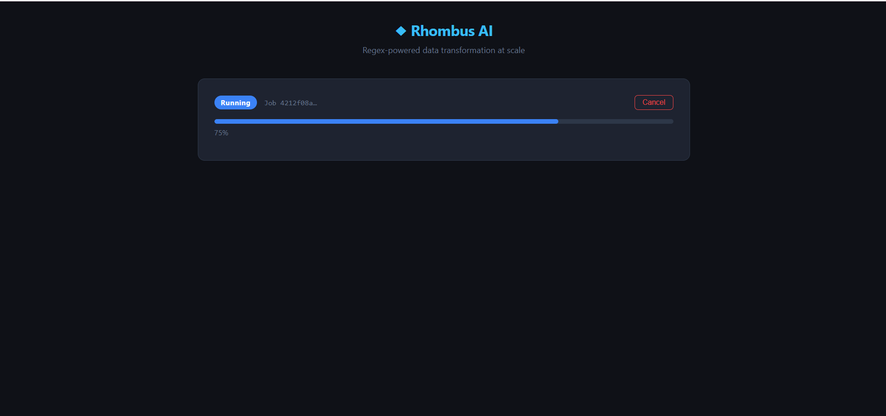
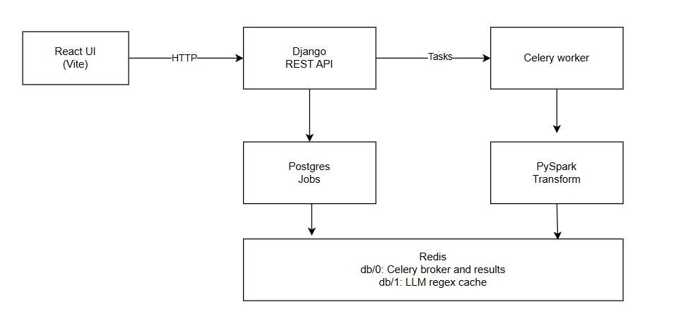

# NL-to-Regex Distributed Data Processing Platform

A full-stack web application that lets users upload CSV/Excel files, describe patterns in natural language, and apply regex transformations at scale using distributed processing.

**Live URL:** https://determined-illumination-production-62b3.up.railway.app

## Demo Video

[](https://youtu.be/odTuPUZ9tlQ)

---

## Architecture



### React + Vite (Frontend)

React handles the user interface — file upload, natural language prompt input, live progress display, paginated results table, job history, and CSV download. Vite is used as the build tool for fast development and optimised production builds. The frontend polls the Django API every 2 seconds for job status updates, which keeps the architecture simple and self-healing compared to WebSockets while being sufficient for jobs that run in the 10-60 second range.

### Django + Django REST Framework (API Layer)

Django serves as the HTTP API layer. Its only responsibility is to accept requests, validate input, write a Job record to Postgres, dispatch a task to Celery, and return a job ID immediately. Django never performs any file processing or LLM calls inline — this ensures the API always responds within milliseconds regardless of dataset size. Django REST Framework provides serialisation, request parsing (including multipart file uploads), and the browsable API for development.

### Celery (Async Task Queue)

Celery runs the actual processing pipeline as a background worker, completely separate from the Django web process. When Django dispatches a task via `process_job.delay(job_id)`, the message is placed on the Redis queue and Celery picks it up independently. Celery was chosen over simple threading because it supports distributed execution (multiple workers), automatic retries with backoff on failure, task state tracking, and cancellation via `revoke()`. Tasks are configured with `acks_late=True` so a message is only acknowledged after the task completes — if the worker crashes mid-task, the message re-queues rather than being silently lost.

### Redis (Message Broker + Cache)

Redis serves two purposes, kept on separate database indices to avoid interference:

- **db/0** — Celery message broker and result backend. Holds the task queue and stores task state (QUEUED, RUNNING, SUCCESS, FAILED) so the polling API can retrieve it.
- **db/1** — LLM response cache. Generated regex patterns are cached here keyed by a SHA-256 hash of the normalised prompt, with a 7-day TTL. This means identical prompts never re-call the LLM API — both saving cost and making repeat requests near-instant.

### PySpark (Data Transformation Engine)

PySpark applies the regex transformation across the dataset. The core operation is Spark's built-in `regexp_replace()` function, which runs as a distributed transformation across partitions rather than iterating row-by-row. For large datasets this is significantly faster than pandas — `pandas.iterrows()` is single-threaded and loads the entire dataset into memory, while Spark partitions the data and processes partitions in parallel. Shuffle partitions are set to 8 (Spark's default is 200) to avoid creating many tiny files for typical dataset sizes. Output is coalesced to a single CSV file for simplified HTTP serving — the trade-off is a single writer, which for very large datasets (>10M rows) would be slower than keeping multiple partitions.

### PostgreSQL (Job Metadata)

PostgreSQL stores Job records — status, progress, file paths, generated regex, error messages, and timestamps. Job state is written here (not only in Redis) so it survives a Redis restart and can be queried by the admin panel. The Job model uses UUID primary keys so job IDs are safe to expose in URLs without leaking row counts.

### Anthropic Claude + Gemini (LLM)

The Anthropic Claude API (`claude-haiku-4-5`) converts the user's natural language prompt into a regex pattern. Haiku was chosen for speed and cost efficiency — regex generation is a simple task that doesn't require a larger model. Google Gemini serves as an automatic fallback if the Anthropic API is unavailable. Generated patterns are validated before use: compiled with Python's `re` module to check syntax, and checked against known catastrophic backtracking constructs.

---

## Request Lifecycle

1. User uploads a file and submits a natural language prompt via the React frontend
2. Django saves the file, creates a Job record (status=`QUEUED`), and returns `{job_id}` immediately
3. React begins polling `GET /api/v1/jobs/{id}/` every 2 seconds
4. Celery picks up the job from the Redis queue
5. Redis cache is checked for the prompt — cache hit returns the regex instantly; cache miss calls the Anthropic API, stores the result in Redis
6. PySpark reads the file, applies `regexp_replace()` across all partitions, writes the result CSV to disk
7. Job is updated to `SUCCESS` with the result file path
8. React receives `SUCCESS`, fetches results paginated at 100 rows per page
9. User downloads the transformed CSV

---

## API Endpoints

| Method | Endpoint | Description |
|--------|----------|-------------|
| `POST` | `/api/v1/jobs/` | Upload file + create job |
| `GET` | `/api/v1/jobs/` | List all jobs |
| `GET` | `/api/v1/jobs/{id}/` | Poll job status and progress |
| `POST` | `/api/v1/jobs/{id}/cancel/` | Cancel a running job |
| `GET` | `/api/v1/jobs/{id}/result/` | Paginated result rows |
| `GET` | `/api/v1/jobs/{id}/download/` | Download result as CSV |
| `DELETE` | `/api/v1/jobs/{id}/delete/` | Delete a job |
| `DELETE` | `/api/v1/jobs/bulk-delete/` | Bulk delete by status |

---

## Setup (Local Development)

### Prerequisites
- Docker + Docker Compose
- An Anthropic API key (console.anthropic.com)
- Optionally a Gemini API key (aistudio.google.com)

### Running Locally

**1. Clone the repo**
```bash
git clone https://github.com/ShatarupaB/llm-regex-patterns.git
cd llm-regex-patterns
```

**2. Create a `.env` file** in the root directory:
```env
DJANGO_SECRET_KEY=your-random-50-char-string
DJANGO_SETTINGS_MODULE=config.settings.dev
DJANGO_DEBUG=True

POSTGRES_DB=rhombus
POSTGRES_USER=rhombus
POSTGRES_PASSWORD=rhombus
POSTGRES_HOST=postgres
POSTGRES_PORT=5432

REDIS_URL=redis://redis:6379/0
REDIS_CACHE_URL=redis://redis:6379/1

ANTHROPIC_API_KEY=sk-ant-your-key-here
GEMINI_API_KEY=your-gemini-key-here

SPARK_MASTER_URL=local[*]
CORS_ALLOWED_ORIGINS=http://localhost:3000
```

**3. Start all services with a single command**
```bash
docker-compose up --build
```

This starts: Django API, Celery worker, Redis, PostgreSQL, PySpark (local mode), Flower monitoring, and the React frontend.

**4. Run migrations**
```bash
docker-compose exec web python manage.py migrate
```

**5. Open the app**
- Frontend: http://localhost:3000
- API: http://localhost:8000/api/v1/jobs/
- Celery monitor (Flower): http://localhost:5555

---

## Testing with Large Datasets

A synthetic 10,000 row employee dataset can be generated using the included script:

```bash
pip install faker
python generate_data.py
```

This produces `test_large.csv` with columns: `ID`, `Full Name`, `Email`, `Phone`, `Company`, `Address`, `Notes`, `Salary`, `Department`, `Join Date`. The dataset intentionally includes some malformed entries (e.g. `invalid-email-123`) to demonstrate that the regex transformation only replaces exact pattern matches, leaving non-matching values unchanged.


---

## Trade-offs and Known Limitations

- **Semantic patterns**: Regex is effective for structural patterns (emails, phone numbers, dates, URLs). Semantic patterns (first names, company names, job titles) may produce imprecise results because they require NLP/NER rather than pattern matching.
- **Excel files**: Excel uploads are converted to an intermediate format via pandas before Spark processing. For very large Excel files, converting to CSV first is recommended.
- **Single output file**: Results are coalesced to one CSV (`coalesce(1)`) for simplified serving. For datasets exceeding 10M rows, keeping multiple output partitions and building a cursor-based streaming API would be more performant.
- **Polling vs WebSockets**: The frontend polls every 2 seconds rather than using WebSockets. This is simpler and self-healing but generates more HTTP requests. For a production system with many concurrent users, Server-Sent Events or WebSockets would be preferable.
